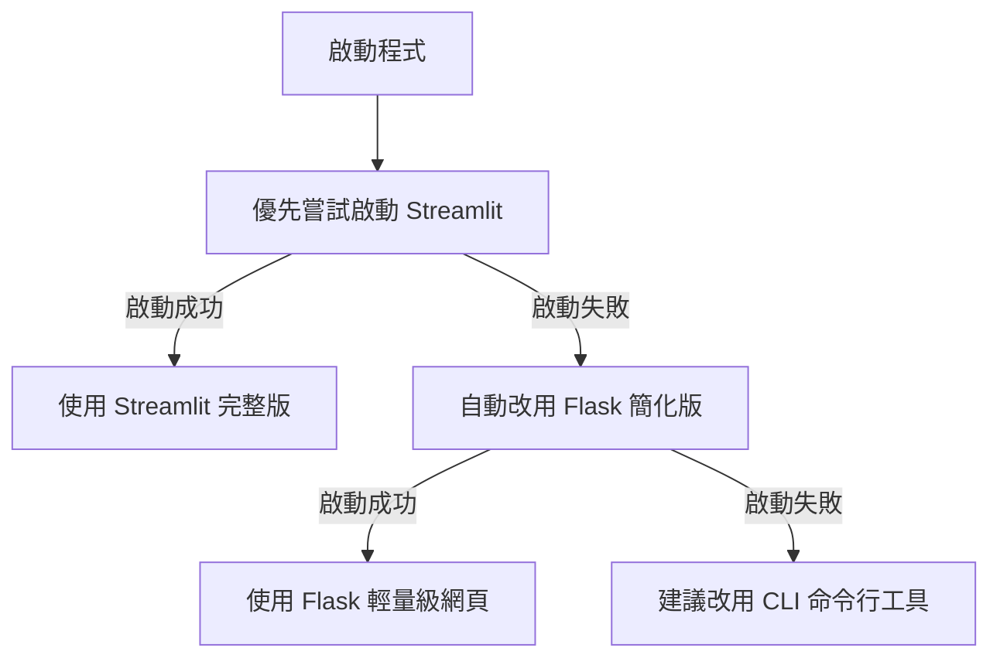

# 🏛️ 立法委員發言自動統計系統

這是一個協助公民監督國會聯盟（公督盟）快速統計立法院會議中各委員發言次數與字數的小工具。

這個專案可作為作品集中的實務案例：服務對象是需要整理立法院逐字稿的公民監督團體，核心要解決的是人工統計立委發言次數與字數相當耗時、且容易因逐份檢閱而增加整理負擔。工程上，我將啟動流程設計為三層自動降級架構，優先提供 Streamlit 完整介面；若執行環境無法支援，則退回 Flask 簡化版；再不行時仍可透過 CLI 完成分析，讓工具在不同部署條件下都能維持可用性與穩定性。

## 📋 功能簡介

- 📊 自動統計各委員發言次數與字數
- 📝 支援多份逐字稿批次處理
- 📄 支援 txt / docx / doc（doc 可自動轉 docx 再轉純文字）
- 🔍 可查看各委員詳細發言內容
- 📥 一鍵匯出 Excel 統計報表
- 🎨 直覺的網頁操作介面

---

## 🖥️ 系統需求

- **作業系統**：Windows / macOS / Linux
- **Python 版本**：Python 3.8 以上
- **`.doc` 轉檔需求**（可選）
  - **Windows**：建議安裝 Microsoft Word（若未安裝，請上傳 `.docx` 或 `.txt`）
  - **macOS**：需安裝 LibreOffice（下方有安裝說明）
  - **Linux**：需安裝 LibreOffice

---

## 🚀 安裝步驟

### 快速啟動（推薦）

無須手動輸入指令，直接執行啟動腳本即可自動檢查環境、安裝套件、啟動應用：

#### Windows 使用者
1. 在資料夾內雙擊 `run.bat` 即可啟動

#### macOS / Linux 使用者
1. 開啟「終端機」
2. 切換到程式資料夾：
   ```bash
   cd /path/to/260127_CCW
   ```
3. 執行啟動腳本：
   ```bash
   bash run.sh
   ```

#### macOS 用戶特別說明：支援 `.doc` 轉檔

如果您要上傳 `.doc` 檔案並自動轉換，需要先安裝 LibreOffice：

**方式 1：使用 Homebrew（推薦，自動識別 Intel/Apple Silicon）**
```bash
brew install libreoffice
```

**方式 2：手動下載**
- 前往 [LibreOffice 官網](https://www.libreoffice.org/download/) 下載 macOS 版本
- 安裝後，程式會自動識別路徑

若未安裝 LibreOffice，您仍可上傳 `.txt` 或 `.docx` 檔案正常使用。

**三層自動降級機制**：
- 優先嘗試啟動 Streamlit（最完整的功能）
- 若失敗，自動改用 Flask 簡化版（輕量級網頁）
- 若都失敗，建議改用命令行工具（純 Python，無界面）

---

### 三種啟動方式詳解

| 方式 | 啟動指令 | 優點 | 缺點 | 適用場景 |
|------|--------|------|------|---------|
| **Streamlit** | `python run.py` 或雙擊 `run.bat`/`run.sh` | 功能最完整、UI 最美觀、委員會篩選 | 依賴較多 | 推薦首選 |
| **Flask 簡化版** | 自動啟動（若 Streamlit 失敗） | 輕量級、依賴少、相容性好 | 功能簡化、無委員會篩選 | Streamlit 無法用時 |
| **命令行工具** | `python analyze_offline.py` | 穩定性最高、零依賴問題、最快 | 無網頁界面、需手動指定檔案 | 批次處理、最後手段 |

---

### 手動安裝步驟（進階）

#### 步驟一：安裝 Python

#### macOS 使用者
1. 開啟「終端機」(Terminal)
2. 安裝 Homebrew（如果還沒安裝）：
   ```bash
   /bin/bash -c "$(curl -fsSL https://raw.githubusercontent.com/Homebrew/install/HEAD/install.sh)"
   ```
3. 安裝 Python：
   ```bash
   brew install python
   ```

#### Windows 使用者
1. 前往 [Python 官網](https://www.python.org/downloads/) 下載最新版本
2. 執行安裝程式，**務必勾選「Add Python to PATH」**
3. 完成安裝

### 步驟二：下載程式碼

1. 下載本專案的所有檔案
2. 解壓縮到一個容易找到的資料夾（例如：`桌面/CCW`）

### 步驟三：安裝所需套件

#### macOS 使用者
1. 開啟「終端機」
2. 切換到程式資料夾：
   ```bash
   cd ~/Desktop/CCW
   ```
   （請依照實際存放位置調整路徑）

3. 安裝所需套件：
   ```bash
   pip3 install -r requirement.txt
   ```

#### Windows 使用者
1. 開啟「命令提示字元」或「PowerShell」
2. 切換到程式資料夾：
   ```cmd
   cd C:\Users\你的使用者名稱\Desktop\CCW
   ```
   （請依照實際存放位置調整路徑）

3. 安裝所需套件：
   ```cmd
   pip install -r requirement.txt
   ```

---

## 🎯 使用方法

### 一、準備資料檔案

#### 1. 委員名單檔案（Excel 格式）

**快速方法：** 直接在程式介面點「📋 下載範本名單（Excel）」，即可下載包含 `委員會`、`黨籍`、`姓名` 三欄的空白範本，修改後即可使用。
- `姓名`：委員姓名（例如：王OO）
- `政黨`：所屬政黨（例如：民進黨、國民黨、民眾黨、無黨籍）

可選欄位：
- `委員會`：例如內政、經濟、交通等（可在介面中篩選）

範例：

| 委員會   | 政黨   | 姓名   |
|----------|--------|--------|
| 內政     | 國民黨 | 王OO |
| 財政     | 民眾黨 | 陳OO |
| 司法法制 | 民進黨 | 黃OO |

> 也支援舊格式（只有 `姓名`、`政黨` 兩欄）。若欄位名稱為 `黨籍` 也可自動辨識。

#### 2. 會議逐字稿檔案（txt / doc / docx）

**支援的檔案格式：**
- `.txt` - 純文字檔（推薦；編碼會自動偵測，包括 UTF-8、Big5、CP950 等）
- `.docx` - Word 新版格式（自動抽取純文字）
- `.doc` - Word 舊版格式（會嘗試自動轉為 `.docx` 後再抽取純文字）

**`.doc` 轉換說明：**
- **Windows**：需安裝 Microsoft Word；若未安裝，請改上傳 `.docx` 或 `.txt`
- **macOS/Linux**：需先 `brew install libreoffice` 或系統套件管理器安裝 LibreOffice
- 若轉換失敗，錯誤訊息會清楚提示如何安裝所需軟體
- 支援立法院官方格式
- 可同時上傳多份逐字稿

### 二、啟動程式

#### 👉 推薦：自動啟動（三層智能降級）
執行啟動腳本，程式會自動選擇最佳啟動方式：

**Windows：** 雙擊 `run.bat` 或在命令提示字元執行 `python run.py`

**macOS / Linux：** 在終端機執行 `bash run.sh` 或 `python3 run.py`

---

#### 方式 1️⃣：Streamlit 完整版（推薦用於網頁應用）

功能最完整，包含委員會篩選、批次處理等。若自動啟動失敗，可手動執行：

**Windows：**
```cmd
python -m streamlit run app.py
```

**macOS / Linux：**
```bash
python3 -m streamlit run app.py
```

執行後會自動打開瀏覽器，顯示完整操作介面。

---

#### 方式 2️⃣：Flask 簡化版（輕量級備用方案）

當 Streamlit 無法啟動時自動切換至此方案。也可手動執行：

**Windows / macOS / Linux：**
```bash
python app_flask.py
```

輕量級網頁版本，支援基本的上傳、分析、下載功能。

---

#### 方式 3️⃣：命令行工具（最穩定，適合批次分析）

無需網頁框架，純 Python 實現。最穩定可靠的方案。

**交互模式**（推薦）：
```bash
python analyze_offline.py
```
程式會逐步引導你選擇檔案和輸出位置。

**命令行參數模式**：
```bash
python analyze_offline.py --label 委員名單.xlsx --transcript 逐字稿.txt --output 結果.xlsx
```

---

### 三、操作流程（Streamlit 完整版）

1. **上傳委員名單**
   - 點選左側「上傳委員名單 (xlsx)」
   - 選擇準備好的 Excel 檔案
   - 系統會顯示「✅ 已載入 X 位委員名單」

2. **上傳逐字稿**
   - 點選左側「上傳逐字稿 (txt/doc/docx，可複選)」
   - 可按住 Ctrl（Windows）或 Command（macOS）選取多個檔案

3. **（可選）篩選委員會**
   - 若名單含 `委員會` 欄位，可在側邊欄多選要分析的委員會

4. **開始分析**
   - 點擊「🚀 開始分析」按鈕
   - 等待進度條跑完

5. **查看結果**
   - 瀏覽統計表格
   - 展開「查看詳細發言紀錄」查看個別委員發言內容

6. **下載報表**
   - 點擊「📥 下載 Excel 報表」
   - 儲存到電腦中

---

## 🏗️ 系統架構



---

## 📁 專案檔案說明

```
260127_CCW/
├── app.py              # Streamlit 主程式（完整版）
├── app_flask.py        # Flask 簡化版（備用方案）
├── analyze_offline.py  # 命令行離線分析工具
├── run.py              # 跨平台智能啟動程式（自動降級）
├── run.bat             # Windows 快速啟動（批次檔）
├── run.sh              # macOS / Linux 啟動（Shell 腳本）
├── functions.py        # 核心功能：解析逐字稿
├── config.py           # 設定檔：黨派排序等
├── requirement.txt     # Python 套件清單
├── README.md           # 本說明文件
├── 委員會/             # 委員名單資料夾
├── 逐字稿/             # 逐字稿資料夾
└── output/             # 輸出結果資料夾
```

---

## ❓ 常見問題

### Q1: 執行 `streamlit run app.py` 出現「找不到指令」錯誤？
**A:** 請確認：
1. Python 已正確安裝
2. 已執行 `pip install -r requirement.txt`
3. 終端機/命令提示字元的路徑在正確的資料夾中

### Q2: 某些委員沒有被統計到？
**A:** 請檢查：
1. 委員名單的「姓名」欄位是否與逐字稿中的名字完全一致
2. 逐字稿中是否為「XXX委員：」的格式
3. 如果名字中有空格（如：[中文姓名] [原文姓名]），請確保名單與逐字稿一致

### Q3: 上傳檔案後，點擊「開始分析」沒反應？
**A:** 可能原因：
1. 委員名單格式不正確（缺少「姓名」或「政黨」欄位）
2. `.doc` 檔在目前環境無法自動轉檔（Windows 請確認已安裝 Word）
3. 逐字稿檔案編碼問題（系統會自動偵測常見編碼如 UTF-8、Big5、CP950）
3. 重新整理網頁後再試一次

### Q7: Windows 的 `run.bat` 無法開啟或 Streamlit 叫不出來怎麼辦？
**A:** 程式會自動降級到 Flask 或命令行工具。若仍無法啟動：
1. 試試改用 `python analyze_offline.py`（最穩定）
2. 或在命令提示字元執行 `python app_flask.py`
3. 詳見上方「三種啟動方式詳解」

### Q8: macOS 的 `run.sh` 無法執行怎麼辦？
**A:** 確保腳本有執行權限：
```bash
chmod +x run.sh
bash run.sh
```
或改用 `python analyze_offline.py`（命令行工具，最穩定）

### Q9: 可以批次分析多個逐字稿嗎？
**A:** 
- **Streamlit 版本** ✅ 可以，上傳檔案時選複選，一次分析多份
- **Flask 版本** ❌ 單次一份，需重複上傳
- **命令行工具** ✅ 可以，執行多次指令或寫 Shell 腳本迴圈

### Q10: 我想在 Linux 伺服器上使用這個程式
**A:** 推薦用命令行工具：
```bash
python analyze_offline.py --label 委員名單.xlsx --transcript 逐字稿.txt --output 結果.xlsx
```
無需任何網頁框架，完全穩定。或配合 cron 排程自動分析。

### Q4: 如何停止程式？
**A:** 在終端機/命令提示字元中按 `Ctrl + C` 即可停止

### Q5: 想要更改黨派排序或基本資訊順序？
**A:** 編輯 `config.py` 檔案中的：
- `party_order`：黨派排序
- `info_order`：基本資訊排序
- `metric_order`：數據欄位排序

---

## 📞 技術支援

如遇到問題無法解決，請聯繫技術負責人並提供：
1. 錯誤訊息截圖
2. 使用的作業系統（Windows / macOS）
3. Python 版本（在終端機執行 `python --version` 查看）

---

## 📝 更新紀錄

- **2026.03** - 升級為三層降級版本
  - ✨ 新增 Flask 簡化版（當 Streamlit 失敗時自動切換）
  - ✨ 新增命令行離線分析工具（最穩定方案）
  - ✨ 三層自動降級機制（Streamlit → Flask → 命令行）
  - ✨ 支援 txt/doc/docx 自動轉檔
  - ✨ 自動編碼偵測（修復 Windows 編碼問題）
  - ✨ 委員會篩選功能
  - ✨ 範本名單一鍵下載

- **2026.02** - 初版發布
  - 支援批次處理多份逐字稿
  - 自動辨識主席身份
  - 詳細發言記錄查看功能

---

**祝使用順利！🎉**
